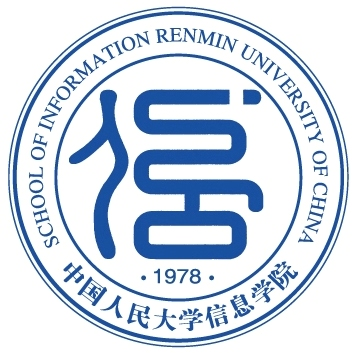
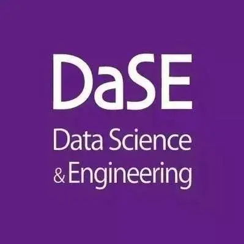
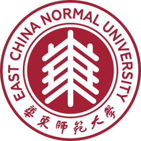

## About Me

I am currently a Master's student (from fall, 2025) at the [School of Information](http://info.ruc.edu.cn/) at [Renmin University of China (RUC)](https://www.ruc.edu.cn/) and a member of the [Advanced Intelligence and MaChine Vision Lab (AIMC Lab)](https://ruc-aimc-lab.github.io/aboutme/), advised by Prof. [Xirong Li](http://info.ruc.edu.cn/jsky/szdw/ajxjgcx/jsjkxyjsx1/js2/fe4411ba1320491698c4c7e555d03510.htm). Before that, I obtained my Bachelor’s degree with distinction from the [School of Data Science and Engineering](https://dase.ecnu.edu.cn/) at [East China Normal University](https://www.ecnu.edu.cn/), where I was privileged to be instructed by Prof. [Bin Yang](https://binyangdk.github.io/) and Prof. [Ye Wang](https://dase.ecnu.edu.cn/37/67/c41776a538471/page.htm) for research and engineering projects.

## Research Interests

- **Multimodal Learning:** MLLM-based Multimodal Representation and Understanding 
- **Video Understanding:** Video Highlights Generation, Streaming Video Understanding
- **AI for Healthcare:** Domain-specific QA&VQA Synthesis and (M)LLM Adaptation

## News

- **[Apr. 2026]** 💻 I joined **Alibaba** as a research intern focusing on MLLM-based Multimodal Embedding.
- **[Oct. 2025]** 💻 I joined **Baidu** as a research intern focusing on MLLM-based Multimodal Embedding.
- **[Sep. 2025]** 📚 I started my master's studies at AIMC Lab, RUC under the supervision of Prof. Xirong Li.
- **[Jun. 2025]** 🎓 I have successfully graduated from ECNU and been honored as an **Outstanding Graduate of East China Normal University**!
- **[Jun. 2025]** 📑 I have been awarded the **Excellent Bachelor Thesis Award**!
- **[May 2025]** 📑 Our paper "[FunBench](https://arxiv.org/abs/2503.00901): Benchmarking Fundus Reading Skills of MLLMs" has been early accepted by **MICCAI 2025**!
- **[Feb. 2025]** 💻 I joined **Meituan** as a research intern focusing on MLLM Post-Training and Evaluation.
- **[Nov. 2023]** 🏆 Our project "[ClipWiz](https://github.com/KaihengQian/ClipWiz): Assistant for Automatic Generation of Video Highlights in Multiple Scenarios" has been honored as the **Shanghai Undergraduate Training Program for Innovation and Entrepreneurship**!
- **[Sep. 2023]** 📚 I started serving as a student tutor this academic year.
- **[Sep. 2021]** 📚 I started my bachelor's studies at DaSE, ECNU.



## Internships

- **[Apr. 2026 - Present]** Research Intern, [AliExpress, Alibaba](https://aidc-jobs.alibaba.com/) , Hangzhou, China
- **[Oct. 2025 - Mar. 2026]** Research Intern, [Qianfan, Baidu](https://cloud.baidu.com/product-s/qianfan_home/) , Beijing, China
- **[Feb. 2025 - Jun. 2025]** Research Intern, [M17, Meituan](https://www.longcatai.org/) , Shanghai, China
- **[Oct. 2024 - Jan. 2025]** Research Assistant, [AIMC Lab, RUC](https://ruc-aimc-lab.github.io/aboutme/), Remote

## Awards & Honors

- **[Oct. 2025]** Third Class Scholarship, Renmin University of China
- **[Jun. 2025]** Excellent Bachelor Thesis Award (*Top 3%*), East China Normal University
- **[May 2025]**  Outstanding Graduate of ECNU, East China Normal University
- **[2023-2024]** Second Class Scholarship for 2 times, East China Normal University
- **[Dec. 2022]** Outstanding Student (*Top 5%*), East China Normal University
- **[Nov. 2022]** Special Prize Scholarship (*Top 2%*), East China Normal University

## Educations

- **[Sep. 2025 - Present]**   &nbsp;&nbsp;&nbsp;Master, School of Information , Renmin University of China , Beijing, China
- **[Sep. 2021 - Jun. 2025]** Undergraduate, School of Data Science and Engineering , East China Normal University  , Shanghai, China

<!--

-->
